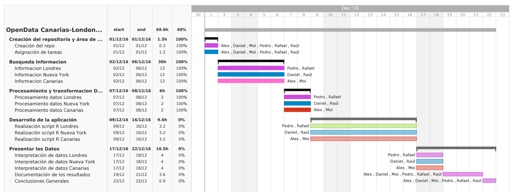

# Práctica final TIO. Grupo 4

## Descripción del proyecto
Al realizar una búsqueda sobre el turismo de cierta ciudad, es díficil saber exactamente el tipo de turista que visita una zona, las ciudades más visitas de cierto país, las fechas más visitadas, etc. En este proyecto, se intentará realizar un análisis del sector del turismo y mediante el tratamiento de lenguaje natural, se podrá responder a todas las preguntas realizadas anteriormente. 
Para el tratamiento del lenguaje natural, se utilizará el lenguaje de programación R con los paquetes necesarios para la realización del tratamiento de datos.
Las ciudades que se analizarán serán: 
* Londres
* Nueva York
* Islas Canarias

### Qué es el tratamiento de lenguaje natural
El procesamiento del lenguaje natural (PLN) es el campo que combina las tecnologías de la ciencia computacional (como la inteligencia artificial, el aprendizaje automático o la inferencia estadística) con la lingüística aplicada, con el objetivo de hacer posible la comprensión y el procesamiento asistidos por ordenador de información expresada en lenguaje humano para determinadas tareas, como la traducción automática, los sistemas de diálogo interactivos, el análisis de opiniones, etc.

Trasladando el PLN al proyecto que se realiza, se puede obtener de una manera fácil la demostración de las temporadas donde más turistas llegan a la ciudad, los turistas que más viajan, las ciudades más visitadas, etc. Estos datos, pueden servir para que diferentes touroperadoras puedan realizar un análisis completo del sector turístico en la ciudad y realizar comparaciones con otros países, mejorar las ofertas para ciudadanos de cierta zona, etc.

## Nombre del proyecto
El nombre de nuestro proyecto será OticAnalyzer.

## Propuesta tecnológica concreta a desarrollar
La realización de una aplicación desarrollada con el entorno de programación R Studio y el lenguaje de programación R. Esta aplicación realizará el análisis de lenguaje natural de la temática de turismo analizando los diferentes destinos, las fechas en las que hay mayor número de turistas, el clima durante todo el año de las diferentes ciudades y la procedencia de los turistas en diferentes años.

## Fuente de datos
Para recabar datos hemos seguido 3 parámetros para cada uno de los lugares a analizar que son, los lugares más emblemáticos o más visitados en esa localidad, cuál suele ser el clima del entorno durante el año y también los países de procedencia de los turistas.

* Londres
    * Lugares:
        * http://travel.usnews.com/London_England/Things_To_Do/
        * http://www.visitlondon.com/things-to-do/sightseeing/london-attraction/top-ten-attractions
        * http://www.planetware.com/tourist-attractions-/london-eng-l-lon.htm
    * Clima:
        * https://www.londoncitybreak.com/climate
        * https://en.wikipedia.org/wiki/Climate_of_London
    * Procedencia (hasta 2015):
        * https://files.datapress.com/london/dataset/number-international-visitors-london/2016-07-25T10:33:39/international-visitors-london-raw.csv
        * http://files.londonandpartners.com/l-and-p/assets/our-insight-london-tourism-review-2014-15.pdf
* Nueva York
    * Lugares:
        * http://www.gocapetravel.com/resources/Top10GuidetoNewYorkCity.pdf
        * http://guides.tripomatic.com/download/tripomatic-free-city-guide-new-york-city.pdf
        * http://expediablog.co.uk/Expedia-New-York-Pocket-Guide.pdf
        * http://uk.complex.com/pop-culture/2013/06/best-summer-dates-in-nyc/fire-guns-at-west-side-rifle-and-pistol-range-and-shoot-mezcal-preferably-in-that-order
        * http://www.americaasyoulikeit.com/Public/Assets/User/files/brochures/AAYLI%20NY%20State%20brochure%20WEB.pdf
    * Clima:
        * https://business.weather.com/writable/documents/Retail/Holiday-eBook-print_FINAL.pdf
        * http://csat.au.af.mil/2025/volume3/vol3ch15.pdf
    * Procedencia
        * http://www.nytimes.com/2016/03/09/nyregion/record-number-of-tourists-visited-new-york-city-in-2015-and-more-are-expected-this-year.html
        * http://www.reuters.com/article/us-usa-newyork-tourism-idUSKBN0L61XM20150202
* Canarias
    * Lugares:
        * http://www.canarias.com/blog/curiosidades-de-canarias/?print=pdf
        * http://www.webtenerife.com/es/galeria-multimedia/folletos/lists/galeriafolletos/folleto%20tenerife%20en%20coche.pdf?iframe=true
        * http://www.todotenerife.es/assets/downloads/db1a973947.pdf
        * http://www.laguiadegrancanaria.com/archivos/guia_turistica_gran_canaria.pdf
        * http://senderosdelapalma.es/wp-content/uploads/mapasenderos.pdf
        * http://www.reservoirbirds.com/TripReports/RBTR_000002.pdf
    * Clima:
        * http://www.gobiernodecanarias.org/educacion/general/gestorglobal/DocsUp/parrafos/5324UD%202%20-%20Clima%20y%20vegetaci%C3%B3n%20de%20Canarias.pdf
        * http://www.elmejorclimadelmundo.com/files/estudioenelanuariodeestudiosatlanticos.pdf
        * http://www.divulgameteo.es/uploads/Caracter%C3%ADsticas-clima-Canarias.pdf
        * http://www.elmejorclimadelmundo.com/files/informedelauniversidaddelalaguna.pdf
        * http://editorial.dca.ulpgc.es/ftp/icaro/Anexos/2-%20CALOR/2-Clima/C.6.2-1%20Islas%20Canarias-Rasgos%20climaticos%20generales-INM.pdf
    * Procedencias: 
        * http://www.ccelpa.org/informe-anual/IA2013/2013/09-2013.pdf
        * http://www.webtenerife.com/es/investigacion/situacion-turistica/informes-situacion-turistica/documents/balance%20de%20situaci%C3%B3n%20tur%C3%ADstica%202015.pdf

## Procesamiento de los datos y transformaciones
Todos los ficheros PDF y artículos web se han transformado a texto plano para su manipulación dentro de R. Para ello hemos usado distintas herramientas, como [PDF to TXT](http://pdftotext.com/es/) o [pdftotext](http://www.tutorialspoint.com/unix_commands/pdftotext.htm) para la conversión a PDF. Para extrar la información de sitios web se han convertido las páginas a PDF y luego se ha extraído.

## Resultados
Los resultados esperados están relacionados con un buen clima en las Islas Canarias y frío y lluvioso en el caso de Londres y Nueva York. En este caso así ha sido, destacando que para Canarias unas de las palabras más repetidas han sido Diciembre y Enero, haciendo alusión al buen tiempo que hay en las islas en este periodo. Esta es la nube de palabras obtenidas para el caso de Canarias:

Para los lugares, en el caso de Canarias esperamos ver playa, costa, Teide, así como sitios emblemáticos o que son muy visitados o conocidos. Para Londres, lugares que no podemos dejar sin visitar suelen ser el Buckingham Palace, el museo Tate de arte moderno, etc. Como vemos en la imagen bajo estas líneas, obtenemos esos lugares, así como los estudios de Harry Potter o la Torre de Londres. En el caso de Nueva York, los lugares más emblemáticos que esperamos ver serían Manhattan, Broadway, Central Park, etc. A continuación, se incluye una captura para el caso de Londres: 

Para analizar la procedencia del turismo, hemos decargado datos en csv con datos numéricos sobre la cantidad de visitantes por países, dividido en años. Para el caso de Canarias, los resultados esperados y obtenidos es un menor número de visitantes en islas no capitalinas, llevándose el grueso de turistas Tenerife y Gran Canarias. Gracias a la base de datos de Open Data de Londres, obtenemos las estadísticas más fiables y detalladas, por lo que vemos que la mayoría provienen de Estados Unidos. El caso que se ilustra bajo estas líneas es el de Nueva York, donde se muestra una gráfica con la evolución de turistas de a lo largo del tiempo, desde 1970 hasta 2012:

Una descripción detallada de los resultados se encuentra en el [archivo de la memoria](Memoria Otic Analyzer.pdf), disponible en este mismo repositorio.

## Diagrama de Gantt del desarrollo del proyecto
Para el desarrollo del proyecto hemos decidido crear un diagrama de Gantt, en el cual dividiremos nuestras proyecto en tareas y subtareas, asignaremos personal y horas, etc. El diagrama resultante es el siguiente:

## Propuesta de modelo de negocio para el desarrollo
La propuesta que seguimos con esta aplicación es la de obtener los datos con respecto al turimo de ciertas ciudades para enviarlos a diferentes touroperadoras y así poder realizar diferentes campañas de atracción de turistas. Con estos datos, se pueden realizar comparaciones entre los países competidores, realizar ofertas para los turistas más potenciales, mejorar la llegada de turistas no tan destacados, etc.
